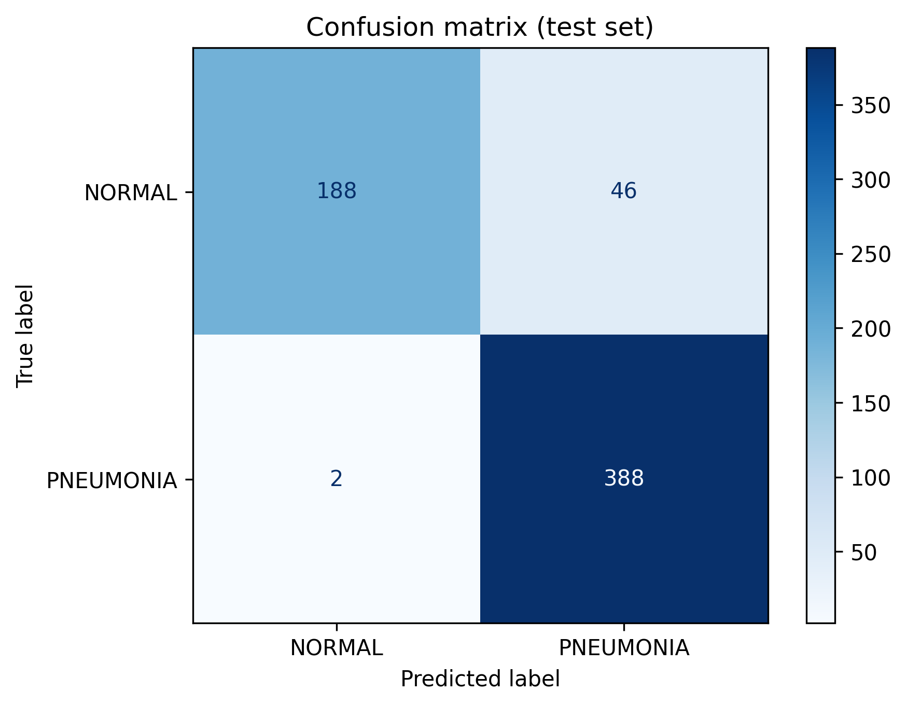
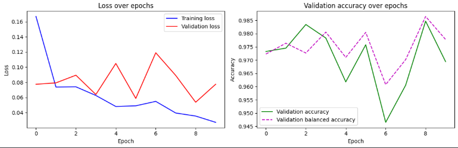

# Pneumonia Detection from Chest X-Rays (ResNet18)

Deep learning project that classifies chest X-ray images as **NORMAL** or **PNEUMONIA**, using transfer learning with an ImageNet-pretrained ResNet18 (PyTorch). Built as a decision-support prototype, not a clinical tool.

## Dataset
[Chest X-Ray Images (Pneumonia)](https://www.kaggle.com/datasets/paultimothymooney/chest-xray-pneumonia) (5,856 images).
- Train: 4,447 images (1,147 NORMAL / 3,300 PNEUMONIA)
- Validation: 785 images (stratified split from the original train + val folders, because the official val folder has only 16 images)
- Test: 624 images (official test set, never used for training or model selection)

## Approach
1. Preprocessing: resize to 224×224, ImageNet normalization
2. Data augmentation: random crop, rotation (10°), brightness/contrast jitter (no horizontal flip, to keep the anatomy consistent)
3. Model: ResNet18 pretrained on ImageNet, final layer replaced for 2 classes
4. Class imbalance: weighted cross-entropy loss (weights computed from the training set)
5. Training: Adam (lr = 1e-4), 10 epochs, best epoch selected on validation balanced accuracy
6. Evaluation: one final evaluation on the held-out test set

## Results (test set, 624 images)

| Metric | Value |
|---|---|
| Accuracy | 92.3% |
| Recall (PNEUMONIA) | 99.5% |
| Specificity (NORMAL) | 80.3% |
| Precision (PNEUMONIA) | 89.4% |
| F1-score (PNEUMONIA) | 0.942 |
| AUC | 0.989 |

Confusion matrix: 388 of 390 pneumonia cases detected; 46 of 234 normal images flagged as pneumonia.

## Limitations
- The model favors recall: it rarely misses pneumonia, but produces false positives on normal X-rays.
- Single dataset, no external validation. Test accuracy is lower than validation accuracy, which is common with this dataset.
- Research/educational prototype, not for clinical use.

## Files
- `main.py`: full pipeline (data loading, training, evaluation, plots)
- `pneumonia_classifier.pth`: trained weights (best epoch)
- `training_history.png`, `confusion_matrix.png`: results

## Run
Tested on Kaggle (GPU). Add the dataset to the notebook, turn Internet on, and run `main.py`. The data folder is detected automatically.

## Author
Ismail Chahboune
